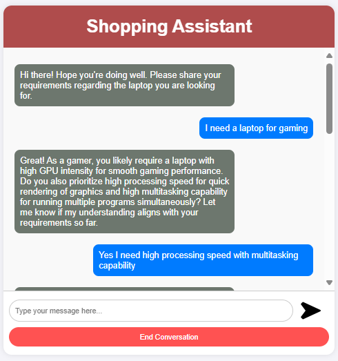
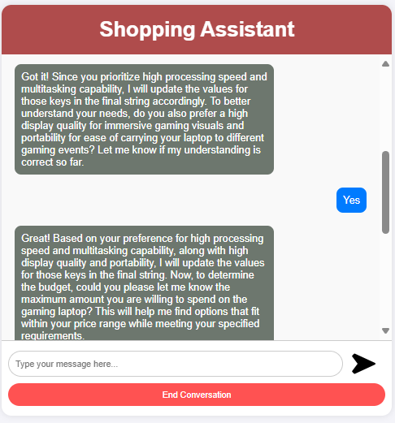
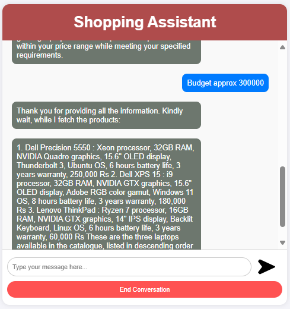

# ShopAssist AI

## 1. Background
In today's digital age, online shopping has become the go-to option for many consumers. However, the overwhelming number of choices and the lack of personalized assistance can make the shopping experience daunting. To address this, we have developed ShopAssist AI, a chatbot that combines the power of large language models and rule-based functions to ensure accurate and reliable information delivery.

## 2. Problem Statement
Given a dataset containing information about laptops (product names, specifications, descriptions, etc.), build a chatbot that parses the dataset and provides accurate laptop recommendations based on user requirements.

## 3. Approach
1. **Conversation and Information Gathering:** The chatbot will utilize language models to understand and generate natural responses. Through a conversational flow, it will ask relevant questions to gather information about the user's requirements.
2. **Information Extraction:** Once the essential information is collected, rule-based functions come into play, extracting the top 3 laptops that best match the user's needs.
3. **Personalized Recommendation:** Leveraging this extracted information, the chatbot engages in further dialogue with the user, efficiently addressing their queries and aiding them in finding the perfect laptop solution.

## 4. System Functionalities

- **User Interface:** ShopAssistAI provides a user-friendly web interface where users can interact with the conversational AI assistant.
- **Conversational AI:** The core of ShopAssistAI is the conversational AI powered by OpenAI's chat model. It guides the user through the process by asking relevant questions and understanding their needs.
- **User Input Moderation:** User input is moderated using OpenAI's moderation API to ensure a safe and secure conversation.
- **User Profile Extraction:** The AI assistant extracts key information from the conversation to build a user profile that reflects their laptop preferences (budget, screen size, processing power, etc.) using OpenAI's function calling mechanism to convert a user requirement string into a JSON object.

We have a dataset `laptop_data.csv` where each row describes the features of a single laptop and also has a small description at the end. The chatbot will leverage large language models to parse this `Description` column and provide recommendations.

## 5. System Architecture

ShopAssistAI follows a client-server architecture. Users interact with the web interface hosted on a server running the Flask application. The application interacts with OpenAI's API for conversation generation and moderation and retrieves and compares laptop data from an external database.


## 6. Implementation Details

The Flask application utilizes various functionalities:

- **Routing:** Maps user requests to appropriate functions based on URLs.
- **Conversation Management:** Handles conversation initiation, response generation through OpenAI's chat model, and conversation history maintenance.
- **User Input Processing:** Captures user input, performs moderation checks, and extracts user profiles from conversation history (converting user input string to JSON using OpenAI Function calling).
- **Recommendation Logic:** Compares user profiles with laptop data, validates recommendations, and generates recommendation text.

  ### Major Functions
- `initialize_conversation()`: Initializes the variable conversation with the system message.
- `get_chat_completions()`: Takes the ongoing conversation as the input and returns the response by the assistant.
- `moderation_check()`: Checks if the user's or the assistant's message is inappropriate. If any of these is inappropriate, it ends the conversation.
- `intent_confirmation_layer()`: Evaluates if the chatbot has captured the user's profile clearly.
- `dictionary_present()`: Checks if the final understanding of the user's profile is returned by the chatbot as a Python dictionary.
- `compare_laptops_with_user()`: Compares the user's profile with the different laptops and comes back with the top 3 recommendations.
- `initialize_conv_reco()`: Initializes the recommendations conversation.


### Prerequisites
- Python 3.7+
- OpenAI API Key(you have to add openai api key in the empty txt file (OpenAI_API_Key))

### Getting Started

To get started with ShopAssist AI, follow these steps:

1. **Clone the repository:**
   ```
   git clone https://github.com/dynamicanupam/ShopAssist-AI.git
   cd ShopAssist-AI
   ```
2. **Lunch VS Code from Anaconda**
   - In VS Code go to `File` > `Open Folder...` and select the `ShopassistAI` folder.
   - Open a terminal in VS Code (``Ctrl+` `` or go to `Terminal` > `New Terminal`).
2. **Install dependencies:**
```   
pip install -r requirements.txt
```
3. **Initialize the conversation:**  
```
python app.py
```
#### Note: This version includes steps to create and activate the Conda environment with Python 3.11.9 0r above, ensuring users set up python environment correctly before installing dependencies and running the application.


## 7. Appendix - B

User output example screenshot:









